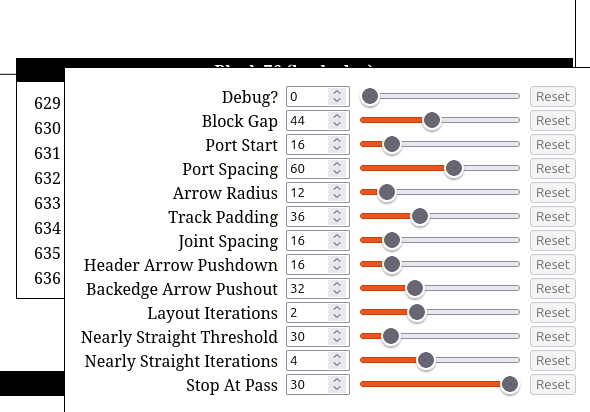

# tweak-ts

A single-file library for the web allowing you to easily modify numeric constants in real time, without changing any code.

```ts
// Before:
const BLOCK_GAP = 44;

// After:
const BLOCK_GAP = tweak("Block Gap", 44, { min: 20, max: 200 });
```



## Installation

Simply copy [tweak.ts](./tweak.ts) or [tweak.js](./dist/tweak.js) into your own codebase.

[Micro-libraries](https://bvisness.me/microlibraries/) are a scourge on the world and a waste of time. But, if you insist, you may also install the package via npm. Just be aware that I could left-pad you. Or my TypeScript version might mess with you. Or I could break things on a patch version and ruin your day. This package comes with a Never 1.0 Guarantee™.

```
npm install tweak-ts
```

## Getting started

1. Import the `tweak` function and add a tweak. Importing the file will initialize the tweak system and will register `window.tweaks`.

    ```ts
    import { tweak } from "./tweak.ts";
    const UI_PADDING = tweak("UI Padding", 20);
    ```

2. Add the UI to the DOM in a location of your choosing:

    ```ts
    document.querySelector("body").appendChild(window.tweaks.container);
    ```

3. Subscribe to changes and update your application state accordingly:

    ```ts
    window.addEventListener("tweak", () => {
      updateAll();
    });
    ```

The resulting Tweak objects will use `valueOf` and `Symbol.toPrimitive` to automatically coerce to numbers when used in expressions. As a result, there is usually no need to modify any code when converting a constant to a Tweak.

One notable exception is that Tweaks will always evaluate to `true` when used in boolean contexts. This is a limitation of the JavaScript spec. The easiest workaround is to simply use a unary plus to first coerce the value to a number before it is evaluated as a boolean:

```ts
const DEBUG = tweak("Debug?", 0, { min: 0, max: 1 });

// Incorrect, will always evaluate to true
if (DEBUG) { /* do debug things */ }

// Correct, will evaluate to true or false as expected
if (+DEBUG) { /* do debug things */ }
```

For more details, see the documentation of the `tweak` function in [tweak.ts](./tweak.ts).